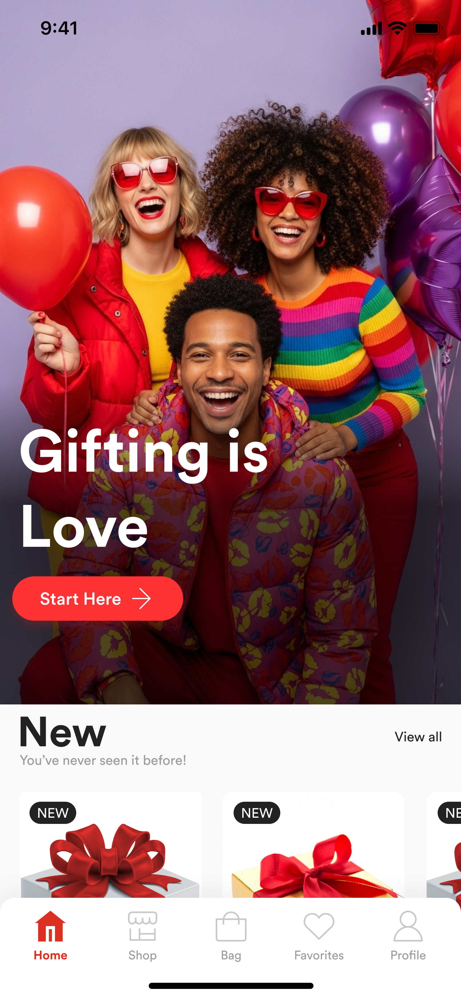

# GoodyBag Landing Page

A beautiful, modern landing page for GoodyBag - the personalized gifting platform that makes gifting personal, beautiful, and stress-free.



## 🎯 Overview

GoodyBag is a gifting and packaging platform that helps individuals and businesses send curated gifts through a mobile app. This landing page is designed to introduce GoodyBag to the public, highlight its features, and collect emails via a waitlist form for early access.

**Launch Date:** December 1st

## ✨ Features

### Landing Page Sections

1. **Hero Section** - Eye-catching introduction with brand tagline and mobile app preview
2. **About Section** - Two-column layout introducing GoodyBag's mission and values
3. **Features Section** - Four feature cards highlighting key benefits:
   - Personalized gifting
   - Smart packaging logic
   - Trusted vendor network
   - Seamless delivery tracking
4. **How It Works** - 3-step visual guide showing the gifting process
5. **Waitlist Form** - Email collection with validation for early access
6. **Vendor/Partner Section** - Call to action for vendors to join the network
7. **Footer** - Complete with links, contact info, and social media

### Design System

#### Brand Colors

- **Primary Red:** `#FF4545` - Main CTA buttons and accents
- **Primary Dark:** `#E63E3E` - Hover states
- **Secondary:** `#1a1a1a` - Headings and text
- **Gray Light:** `#F5F5F5` - Backgrounds
- **Gray Medium:** `#9CA3AF` - Secondary text
- **Gray Dark:** `#4B5563` - Body text

#### Typography

- **Font Family:** Poppins (weights: 400, 500, 600, 700, 800)
- **Text Logo:** Poppins Bold (700), 72px, line-height 108px

#### Design Elements

- Rounded corners on all cards and buttons
- Soft shadows for depth
- Clean white space
- Premium, joyful aesthetic
- Smooth animations and transitions

## 🚀 Getting Started

### Prerequisites

- Node.js 18.17 or later
- npm or yarn package manager

### Installation

1. Clone the repository or navigate to this directory:

```bash
cd "landing page"
```

2. Install dependencies:

```bash
npm install
```

3. Run the development server:

```bash
npm run dev
```

4. Open [http://localhost:3000](http://localhost:3000) in your browser to see the result.

### Build for Production

```bash
npm run build
npm start
```

## 📁 Project Structure

```
landing page/
├── app/
│   ├── favicon.ico
│   ├── globals.css          # Global styles and Tailwind configuration
│   ├── layout.tsx            # Root layout with SEO metadata
│   └── page.tsx              # Main landing page
├── components/
│   ├── Hero.tsx              # Hero section with CTA
│   ├── About.tsx             # About section
│   ├── Features.tsx          # Features showcase
│   ├── HowItWorks.tsx        # 3-step process
│   ├── WaitlistForm.tsx      # Email collection form
│   ├── VendorPartner.tsx     # Partner CTA section
│   └── Footer.tsx            # Footer with links
├── public/
│   ├── hero-1.png            # Brand images from Figma
│   ├── hero-2.png
│   └── hero-3.png
├── package.json
└── README.md
```

## 🎨 Customization

### Updating Colors

Edit the CSS variables in `app/globals.css`:

```css
:root {
  --primary: #ff4545;
  --primary-dark: #e63e3e;
  --secondary: #1a1a1a;
  /* ... */
}
```

### Adding Images

Place images in the `public/` folder and reference them with:

```tsx
import Image from "next/image";

<Image src="/your-image.png" alt="Description" width={500} height={500} />;
```

### Modifying Content

Each section is a separate component in the `components/` folder. Update the content directly in the respective component file.

## 📊 SEO Optimization

The landing page includes comprehensive SEO metadata:

- **Title:** GoodyBag - Gifting Made Personal, Beautiful, and Stress-Free
- **Description:** Optimized for search engines
- **Open Graph tags:** For social media sharing
- **Twitter Card:** For Twitter sharing
- **Structured data:** Ready for implementation
- **Semantic HTML:** Proper heading hierarchy and landmarks

## 🔧 Technologies Used

- **Framework:** Next.js 14 (App Router)
- **Language:** TypeScript
- **Styling:** Tailwind CSS v4
- **Font:** Poppins (Google Fonts)
- **Deployment Ready:** Optimized for Vercel, Netlify, or any hosting platform

## 📱 Responsive Design

The landing page is fully responsive and optimized for:

- Desktop (1920px+)
- Laptop (1024px - 1919px)
- Tablet (768px - 1023px)
- Mobile (320px - 767px)

## 🎯 Performance Features

- Server-side rendering (SSR)
- Optimized images with Next.js Image component
- Font optimization
- CSS-in-JS with Tailwind
- Lazy loading
- Smooth scroll behavior

## 📝 Form Handling

The waitlist form includes:

- Client-side validation
- Error messaging
- Success state with confirmation message
- User type selection (Individual/Business)
- Clean UX with loading states

### Backend Integration

To connect the form to your backend, update the `handleSubmit` function in `components/WaitlistForm.tsx`:

```tsx
const handleSubmit = async (e: React.FormEvent) => {
  e.preventDefault();

  if (!validateForm()) return;

  setIsSubmitting(true);

  try {
    const response = await fetch("/api/waitlist", {
      method: "POST",
      headers: { "Content-Type": "application/json" },
      body: JSON.stringify(formData),
    });

    if (response.ok) {
      setIsSubmitted(true);
      // Reset form or show success message
    }
  } catch (error) {
    console.error("Error submitting form:", error);
  } finally {
    setIsSubmitting(false);
  }
};
```

## 🚀 Deployment

### Deploy to Vercel

The easiest way to deploy this Next.js app is using [Vercel](https://vercel.com):

```bash
npm i -g vercel
vercel
```

### Deploy to Netlify

1. Build the project: `npm run build`
2. Deploy the `.next` folder to Netlify

### Environment Variables

If you add backend integration, create a `.env.local` file:

```env
NEXT_PUBLIC_API_URL=your-api-url
# Add other environment variables as needed
```

## 🤝 Contributing

This is a custom project for GoodyBag. For any questions or modifications, please contact the development team.

## 📄 License

All rights reserved. © 2025 GoodyBag

## 🎁 Brand Assets

All brand materials, including colors, typography, and imagery, are sourced from the GoodyBag mobile app design system and Figma screens located in the parent `figma/` folder.

## 📞 Contact

- **Email:** admin@goodybag.africa
- **WhatsApp:** [Add your number]
- **Website:** [Add your URL]

---

Built with ❤️ for the GoodyBag launch on December 1st, 2025
